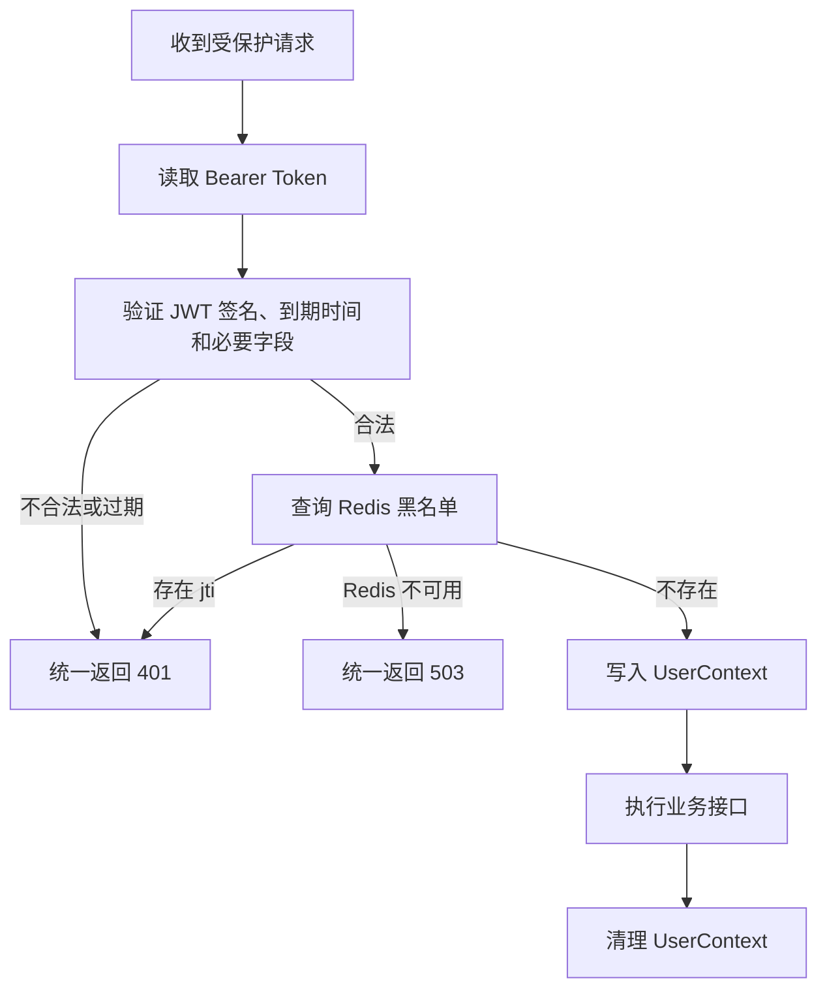

# 口袋账本退出登录功能详细实施方案

> 执行说明：本文仅为实现文档，尚未实施。后续可按 `executing-plans` 技能逐任务执行；子代理仅可用于探索、检索和核验，业务代码修改与最终验证由主执行者负责。步骤使用复选框跟踪。

**目标：** 保留项目现有 JWT 登录方式，实现“退出时把当前 Token 的 `jti` 写入 Redis 黑名单，TTL 为 Token 剩余有效期；后续请求统一拒绝该 Token”。

**架构：** 登录时签发带独立 `jti` 的 JWT。鉴权拦截器完成 JWT 校验后检查 Redis 黑名单；退出接口复用鉴权上下文，记录撤销信息。前端先请求退出接口，再清除本地认证和页面状态。

**技术栈：** Java 8、Spring Boot 2.3.0.RELEASE、JJWT 0.11.5、Spring Data Redis（由现有 Spring Boot 管理版本），以及原生 HTML / JavaScript 静态前端。

**设计依据：** 本次对话已确认的 JWT + Redis `jti` 黑名单方案。本文同时记录接口契约、边界取舍和逐文件实施步骤，无需依赖另一份未提供的设计文档。

**核查日期：** 2026-09-19。

## 1. 全局约束与本次范围

- 本次交付仅维护本文档，不修改业务代码、配置、依赖或数据库。
- 后续前端实施范围仅为 `fronted_static`；用户所称静态前端在仓库中的实际目录名为 `fronted_static`，不改目录名。`frontend_vue` 明确排除，不修改其代码、配置、依赖、测试或构建流程。
- 后续实施会涉及三个以上文件，必须先把实际文件改动清单和中文实施方案交给用户确认，再编码。认可本文方案不等于已经要求立即实施。
- 不修改 `settings.json`；执行时如遇到其中 `deny` 明确禁止的操作，应停止并说明。
- 保持 Java 8、Spring Boot 2.3.0.RELEASE 和现有 JJWT 0.11.5；不顺带升级框架。
- 保持现有 Controller → Service 分层，以及 `ResultCode`、`BusinessException`、`ApiResponse` 体系。
- 保持登录返回 `{access_token, token_type}`；`jti` 放在 JWT 内，不新增登录响应字段。
- 保持 `pl_token`、`pl_api_base`、`pl_theme` 等前端存储键。
- 不引入完整 Spring Security 过滤器链、OAuth2、刷新令牌、数据库 Token 表、在线设备管理或退出全部设备。
- 默认仅撤销此次提交的 Token；其他独立登录拥有不同 `jti`，不受影响。
- 文中代码是待实施参考，未编译、未运行。示例以当前项目结构为基准，合并时保留无关现有代码。

项目根目录：`C:/fly_develop/java_ai_project/pocket_ledger_java_fly`。下文文件路径均相对此目录，Java 包根为 `com.fly.pocket_ledger_java`。

## 2. 项目现状及可复用实现

### 2.1 已确认的调用链

```text
登录：AuthController.login()
       → AuthServiceImpl.login()
       → JwtUtils.generateToken()

请求：AuthInterceptor.preHandle()
       → JwtUtils.parseToken()
       → UserContext.set(loginUser)
       → Controller / Service
       → afterCompletion() 清理 UserContext

静态前端退出：app.js 中 logoutBtn 点击事件
               → API.logout() 清除本地 Token
               → location.reload() 重载页面、清空内存状态
```

| 已有文件 / 符号 | 当前行为 | 本次复用或扩展 |
| --- | --- | --- |
| `backend/src/main/java/com/fly/pocket_ledger_java/controller/AuthController.java` | 提供注册、登录、当前用户接口 | 增加 `POST /auth/logout` |
| `service/AuthService.java`、`service/impl/AuthServiceImpl.java` | 密码校验、签发 Token、查询当前用户 | 增加退出业务，保留原有登录逻辑 |
| `util/JwtUtils.java` | JWT 含 `sub`、`username`、`iat`、`exp`，没有 `jti` | 增加唯一编号，解析并校验必要字段 |
| `util/LoginUser.java` | 保存 `id`、`username` | 增加 `tokenId`、`expiresAtMillis`，承载已验证的令牌信息 |
| `util/UserContext.java` | 用 ThreadLocal 保存当前请求的 `LoginUser` | 原样复用 `get()`、`set()`、`clear()` |
| `interceptor/AuthInterceptor.java` | 验签和过期校验后直接放行 | 增加黑名单检查，继续复用 401 输出和上下文清理 |
| `common/ResultCode.java` | 现有 `UNAUTHORIZED` 注释已包含“已拉黑” | 复用 401，增加认证依赖不可用的 503 |
| `exception/GlobalExceptionHandler.java` | `BusinessException` 转为同状态码的统一响应 | 原样复用，不另建异常处理器 |
| `vo/ApiResponse.java` | `{code,message,data}` 响应 | 复用 `success("退出成功", null)` |
| `fronted_static/js/api.js` | `request()` 自动携带 Token，401 标记 `error.auth`；`logout()` 仅清本地 Token | 复用请求封装与错误标记，改成异步调用退出接口 |
| `fronted_static/js/app.js` | 点击退出直接刷新；启动恢复失败也调用 `API.logout()` | 点击时等待退出请求，启动恢复失败改为 `API.clearToken()` |

现有 `backend/pom.xml` 仅引入 `spring-security-crypto` 用于密码哈希，没有启用 Spring Security 鉴权过滤器链，也没有 Redis starter。当前运行配置 `jwt.expire-minutes: 1440`，即 24 小时；`JwtProperties` 类内默认值 120 分钟被该配置覆盖。

在项目自有代码和文档中按 Redis、黑名单、退出、Token 解析及其调用位置进行了检索，排除了 `node_modules`、`target`、`dist` 和依赖锁文件。未查到可复用的 Redis 撤销组件。最相似的业务就是已有认证模块；`service/support` 也已有 `BillRules`、`BillAssembler` 等专职组件。

因此建议只新增一个生产组件 `service/support/TokenBlacklist.java`。它负责 Key、TTL、Redis 查询与写入；不创建通用 `RedisUtils`、另一套认证 Service、新 DTO/VO 或新的异常类。它不适合放进 `JwtUtils`，因为 JWT 的签发解析不应依赖 Redis。

### 2.2 必须注意的现有测试与资料

- `AuthControllerWebTest.removedLogoutEndpointReturns404()` 明确断言 `/auth/logout` 不存在，实施时必须替换。
- `AuthInterceptorTest` 直接调用旧构造方法 `new AuthInterceptor(jwtUtils, new ObjectMapper())`，新增依赖后要同步更新。
- `BillControllerWebTest` 使用 `new LoginUser(7L, "reed")`；新增字段时保留双参数构造方法，避免无关测试大面积改动。
- 静态前端为零构建的原生页面，沿用浏览器联调验收，不为本次功能引入前端测试框架。
- `fronted_static/js/api.js` 默认 API 地址为 `http://localhost:8080`；浏览器保存的 `pl_api_base` 会覆盖默认值。当前 Java 配置未设置 `server.port`，本地默认端口为 8080；联调时核对实际地址。
- 部分注释引用 `docs/pocket-ledger-api.html`，本次检查未找到该文件；退出契约以本文为依据，不假设该文件存在。

## 3. 目标行为与接口契约

### 3.1 登录与普通业务请求

登录成功后新签发的 JWT 示例载荷：

```json
{
  "sub": "7",
  "username": "reed",
  "jti": "a0b0ce91-c0ec-4d41-b604-6bde42f78f5a",
  "iat": 1800000000,
  "exp": 1800086400
}
```

上面是结构示例，其中时间为秒级 Unix 时间戳，示例相差 24 小时；实际由签发时刻计算，`jti` 每次重新生成。对外登录响应仍是项目现有 `TokenVO`，不向业务 API 暴露 `LoginUser`。



登录时不往黑名单写记录。每次受保护请求，包括 `/auth/me` 和账单接口，都先验 JWT，再查黑名单。现有公开接口和 OPTIONS 预检按原配置处理。

“退出后立即失效”指退出写入成功后，随后执行鉴权的请求会被拒绝。已经通过黑名单检查、正在执行的请求不会自动取消，也不会回滚已经提交的业务操作；当前方案不提供在途业务强制中止能力。

### 3.2 退出请求

```http
POST /auth/logout
Authorization: Bearer <当前Token>
```

无需请求体，不接收客户端独立传入的 `userId`、`jti` 或 `exp`。这些信息只从已经验签的 JWT 获取。

成功响应：

```json
{
  "code": 200,
  "message": "退出成功",
  "data": null
}
```

认证失败沿用现有响应：

```json
{
  "code": 401,
  "message": "未登录或登录已失效",
  "data": null
}
```

Redis 无法查询或无法写入：

```json
{
  "code": 503,
  "message": "认证服务暂不可用，请稍后重试",
  "data": null
}
```

HTTP 状态码与响应体 `code` 保持一致。不在 `auth.ignore-urls` 中加入 `/auth/logout`，不绕过现有鉴权。

### 3.3 重复退出的明确取舍

为复用现有拦截器，本文选择**状态幂等，而不是每次都返回 200**：

| 情况 | 后端结果 | 前端行为 |
| --- | --- | --- |
| 合法且未撤销的 Token | 写入黑名单，返回 200 | 清本地 Token，刷新到登录页面 |
| 同一 Token 再次退出 | 拦截器发现已撤销，返回 401 | 当作认证已失效，完成本地退出，不弹重复错误 |
| Token 已过期、无效，或旧 Token 缺少必需字段 | 401 | 本地退出，无需继续撤销无效令牌 |
| 本地已没有 Token | 无需发请求 | 本地退出 |
| Redis 连接/读写失败 | 503 | 清本地，提示“本地已退出，服务端注销未确认” |
| 网络超时 / 断网 / 其他错误 | 请求失败或结果不确定 | 同上，不声称服务端一定成功或一定失败 |

重复执行不会恢复登录、不会增加新权限、不会产生新 Token，因此状态是幂等的。不要为了把第二次退出改为 200，就把退出接口加到鉴权白名单或信任未经校验的载荷。

已经在首次退出前通过黑名单检查的并发退出请求，可能都到达 Service；重复写同一个 Key 没有副作用。TTL 每次从原始 `exp` 重新计算，不能每次重新给 24 小时。

## 4. Redis 数据与 TTL 设计

### 4.1 Key 约定

```text
Key：   auth:revoked:{jti}
类型：  String
Value： 1
TTL：   expMillis - System.currentTimeMillis()
```

例如 Token 在 20:00 到期、17:00 退出，则保存约 3 小时。黑名单记录自然失效后，JWT 本身也不能再通过到期校验，无需定时清理任务。

本文使用**毫秒 TTL**：Spring Data Redis `set(key, value, ttlMillis, TimeUnit.MILLISECONDS)`，对应 Redis 一条带到期参数的写命令。它与 `SET ... EX 秒数` 的方案语义相同，但避免把剩余不足 1 秒向下取整为 0。

如果改用秒，必须向上取整，而不是直接整数除法：

```java
long ttlSeconds = (remainingMillis + 999L) / 1000L;
```

Redis 支持在 `SET` 中同时设置 `EX` 或 `PX`，不能拆成先 `SET` 再 `EXPIRE`，否则两次调用之间失败可能留下永久记录。[Redis SET 官方说明](https://redis.io/docs/latest/commands/set/)

### 4.2 到期边界与时钟

- 当前 `JwtUtils` 没有配置 JWT 时钟容差，本文保持为 0。
- `exp` 来自 JJWT 解析得到的 `Date`，使用 `getTime()` 转成毫秒；不得把 JWT 秒级数值直接与毫秒时间相减。
- 剩余有效期 `<= 0` 时跳过写入，视为 Token 已自然失效；此分支也处理“拦截器通过后、到达 Service 前刚好过期”的情况。
- 若以后启用 `allowedClockSkewSeconds`，TTL 要覆盖 `exp + 容差 - now`，并增加相应测试。
- 多实例需要可靠时间同步。零容差不代表不同机器时钟天然一致；如果存在允许的实例时钟差，还要覆盖该差值，不能让黑名单在某实例仍接受 JWT 时提前消失。
- 不保存原始 JWT，不把 Token 放入日志，也不保存用户密码等信息。

### 4.3 故障与数据可靠性

黑名单是认证撤销状态，不能按普通可丢失缓存管理：

- Redis 查询失败时返回 503，不把异常当成“不在黑名单”。
- Redis 写入失败时返回 503；只有确认写入完成才能返回退出成功。
- 所有应用实例连接同一逻辑黑名单数据源，撤销判断使用可满足一致性要求的读取方式，不使用可能滞后的只读副本。
- 开发、测试、生产使用隔离的 Redis 实例或命名空间，避免环境混用。
- 生产应规划持久化、容量、淘汰策略和故障恢复；黑名单不能在 Token 到期前因为内存淘汰而消失。
- 普通异步复制和持久化仍可能在故障切换时丢失近期写入；如果撤销记录完整性无法确认，应暂停受保护流量并恢复记录，或通过受控密钥轮换使受影响旧 Token 失效，再恢复服务。
- Redis 恢复为空时，单纯“连接已恢复”不能证明撤销状态已恢复。黑名单丢失会使尚未过期的已退出 Token 再次可用。

不为当前功能额外引入数据库双写或消息队列。上述是方案运行条件和故障边界，不是本文已经实现的运维能力。

## 5. 文件改动清单

### 5.1 后端生产文件

| 操作 | 文件 | 职责 |
| --- | --- | --- |
| 修改 | `backend/pom.xml` | 添加 Redis starter，由现有父 POM 管理版本 |
| 修改 | `backend/src/main/resources/application.yml` | 在原 `spring` 节点下添加 Redis 连接配置 |
| 修改 | `backend/src/main/java/com/fly/pocket_ledger_java/util/JwtUtils.java` | 签发 `jti`，解析必要字段 |
| 修改 | `backend/src/main/java/com/fly/pocket_ledger_java/util/LoginUser.java` | 扩展当前身份携带的令牌信息 |
| 新增 | `backend/src/main/java/com/fly/pocket_ledger_java/service/support/TokenBlacklist.java` | 黑名单存取与 TTL |
| 修改 | `backend/src/main/java/com/fly/pocket_ledger_java/common/ResultCode.java` | 新增 503 错误枚举 |
| 修改 | `backend/src/main/java/com/fly/pocket_ledger_java/interceptor/AuthInterceptor.java` | 增加统一黑名单校验 |
| 修改 | `backend/src/main/java/com/fly/pocket_ledger_java/service/AuthService.java` | 增加 `void logout()` |
| 修改 | `backend/src/main/java/com/fly/pocket_ledger_java/service/impl/AuthServiceImpl.java` | 从上下文取当前令牌并撤销 |
| 修改 | `backend/src/main/java/com/fly/pocket_ledger_java/controller/AuthController.java` | 暴露退出接口 |

`UserContext`、`TokenVO`、用户 Mapper、实体、数据库表和全局异常处理器无需修改。

### 5.2 静态前端文件

| 操作 | 文件 | 职责 |
| --- | --- | --- |
| 修改 | `fronted_static/js/api.js` | 静态前端调用后端退出 |
| 修改 | `fronted_static/js/app.js` | 等待退出后刷新，恢复失败只清本地 |

前端只实施上面两个文件。`frontend_vue` 不属于本次改动、测试或发布范围，完成标准以本次后端和静态前端链路为准。

### 5.3 测试文件

- 扩展 `backend/src/test/java/com/fly/pocket_ledger_java/interceptor/AuthInterceptorTest.java`。
- 扩展 `backend/src/test/java/com/fly/pocket_ledger_java/controller/AuthControllerWebTest.java`。
- 新增 `backend/src/test/java/com/fly/pocket_ledger_java/util/JwtUtilsTest.java`。
- 新增 `backend/src/test/java/com/fly/pocket_ledger_java/service/support/TokenBlacklistTest.java`。
- 新增 `backend/src/test/java/com/fly/pocket_ledger_java/controller/AuthLogoutWebTest.java`，验证真实拦截器、真实退出 Service 与 MVC 异常响应的组合。
- 静态前端按第 11.2 节执行浏览器验收，不新增前端测试文件。

## 6. 任务一：补齐令牌唯一身份

**输入接口：** 现有 `JwtUtils.generateToken(Long, String)`、`parseToken(String)`。

**输出接口：** 签名不变；`parseToken()` 返回带 `tokenId`、`expiresAtMillis` 的 `LoginUser`。

- [ ] 在 `JwtUtilsTest` 先验证：同一用户连续签发两个 Token，`jti` 不相同。
- [ ] 验证解析后可取得 `id`、`username`、`tokenId`、`expiresAtMillis`。
- [ ] 验证签名有效但没有 `jti` 或没有 `exp` 的 Token 被拒绝。
- [ ] 按以下方式扩展 `LoginUser`，保留已有双参数构造方法。

```java
@Data
@NoArgsConstructor
@AllArgsConstructor
public class LoginUser {
    private Long id;
    private String username;
    private String tokenId;
    private long expiresAtMillis;

    // 兼容已有业务测试；鉴权成功时必须使用包含令牌信息的构造方法。
    public LoginUser(Long id, String username) {
        this.id = id;
        this.username = username;
    }
}
```

- [ ] 在 `generateToken()` 原有构建链中添加 `setId()`，保留原有签名算法、用户字段和有效期逻辑。

```java
return Jwts.builder()
        .setId(UUID.randomUUID().toString())
        .setSubject(String.valueOf(userId))
        .claim("username", username)
        .setIssuedAt(now)
        .setExpiration(expiresAt)
        .signWith(secretKey, SignatureAlgorithm.HS256)
        .compact();
```

新增导入 `java.util.UUID`。不得用用户 ID、用户名或当前秒级时间作为 `jti`。

- [ ] 保留 `parseClaimsJws()` 原有验签和过期校验，将取得 `Claims` 之后的转换替换为：

```java
String tokenId = claims.getId();
Date expiresAt = claims.getExpiration();
String username = claims.get("username", String.class);
if (!StringUtils.hasText(tokenId)
        || expiresAt == null
        || !StringUtils.hasText(claims.getSubject())
        || !StringUtils.hasText(username)) {
    throw new JwtException("令牌缺少必要字段");
}
return new LoginUser(
        Long.valueOf(claims.getSubject()),
        username,
        tokenId,
        expiresAt.getTime()
);
```

新增导入 `io.jsonwebtoken.JwtException`、`org.springframework.util.StringUtils`。数字格式不合法会抛出 `IllegalArgumentException` 的子类，继续由现有拦截器转为 401。

**旧 Token 迁移策略：** 本次采用缺少 `jti` 的旧 Token 直接返回 401，用户重新登录。这是明确的上线行为，不能默默兼容为“永远不查黑名单”的令牌。若以后要求无感迁移，应另行设计过渡方案；本次不加入基于 Token 摘要的第二套 Key。

**部署要求：** 必须让所有对外服务实例都启用黑名单校验；滚动发布中旧实例仍可能接受已退出 Token。当前规模建议协调切换并要求一次重新登录。

## 7. 任务二：接入 Redis 并实现专职黑名单组件

**输入接口：** 已验证的 `tokenId` 与 `expiresAtMillis`。

**输出接口：** `boolean isRevoked(String tokenId)`、`void revoke(String tokenId, long expiresAtMillis)`。

- [ ] 在 `backend/pom.xml` 添加以下依赖，不手写 Spring Data Redis 或 Lettuce 版本：

```xml
<dependency>
    <groupId>org.springframework.boot</groupId>
    <artifactId>spring-boot-starter-data-redis</artifactId>
</dependency>
```

- [ ] 在 `application.yml` **现有 `spring:` 节点下合并**以下 `redis:` 配置；不要新增第二个同名顶层节点：

```yaml
spring:
  redis:
    host: ${REDIS_HOST:127.0.0.1}
    port: ${REDIS_PORT:6379}
    password: ${REDIS_PASSWORD:}
    database: ${REDIS_DATABASE:0}
    timeout: 2s
```

这里用的是 Boot 2.3 的 `spring.redis.*`，不是新版本的 `spring.data.redis.*`。本地需另行准备 Redis 服务，本文不假设机器已经安装 Redis。默认超时是初始建议值，联调需验证实际客户端超时行为。[Boot 2.3 配置参考](https://docs.spring.io/spring-boot/docs/2.3.0.RELEASE/reference/html/appendix-application-properties.html)

- [ ] 在 `ResultCode` 中现有末尾分号之前增加枚举项：

```java
AUTH_SERVICE_UNAVAILABLE(503, "认证服务暂不可用，请稍后重试"),
```

- [ ] 在 `TokenBlacklistTest` 先写 TTL、过期跳过、Redis 异常用例，然后实现组件：

```java
package com.fly.pocket_ledger_java.service.support;

import com.fly.pocket_ledger_java.common.ResultCode;
import com.fly.pocket_ledger_java.exception.BusinessException;
import lombok.extern.slf4j.Slf4j;
import org.springframework.dao.DataAccessException;
import org.springframework.data.redis.core.StringRedisTemplate;
import org.springframework.stereotype.Component;
import java.util.concurrent.TimeUnit;

@Slf4j
@Component
public class TokenBlacklist {
    private static final String KEY_PREFIX = "auth:revoked:";
    private final StringRedisTemplate redisTemplate;

    public TokenBlacklist(StringRedisTemplate redisTemplate) {
        this.redisTemplate = redisTemplate;
    }

    public boolean isRevoked(String tokenId) {
        try {
            Boolean exists = redisTemplate.hasKey(KEY_PREFIX + tokenId);
            // 普通同步调用应返回 true/false，不能把不确定结果当成未撤销。
            if (exists == null) {
                throw new BusinessException(ResultCode.AUTH_SERVICE_UNAVAILABLE);
            }
            return exists;
        } catch (DataAccessException exception) {
            log.error("读取令牌撤销状态失败", exception);
            throw new BusinessException(ResultCode.AUTH_SERVICE_UNAVAILABLE);
        }
    }

    public void revoke(String tokenId, long expiresAtMillis) {
        long remainingMillis = expiresAtMillis - System.currentTimeMillis();
        if (remainingMillis <= 0) {
            return;
        }
        try {
            redisTemplate.opsForValue().set(
                    KEY_PREFIX + tokenId,
                    "1",
                    remainingMillis,
                    TimeUnit.MILLISECONDS
            );
        } catch (DataAccessException exception) {
            log.error("写入令牌撤销状态失败", exception);
            throw new BusinessException(ResultCode.AUTH_SERVICE_UNAVAILABLE);
        }
    }
}
```

此组件仅接受已验证的内部参数，不直接暴露 HTTP 接口。使用同步操作，不使用 Redis pipeline 或 Redis 事务；不增加 `@Transactional`，MySQL 事务不能保证 Redis 写入的原子性。

**最小 TTL 测试示例：** 放进 `TokenBlacklistTest`，使用现有 JUnit 5 和 Mockito。此用例不连接真实 Redis。

```java
@Test
@SuppressWarnings("unchecked")
void writesRemainingLifetimeInMilliseconds() {
    StringRedisTemplate redis = mock(StringRedisTemplate.class);
    ValueOperations<String, String> values = mock(ValueOperations.class);
    when(redis.opsForValue()).thenReturn(values);
    TokenBlacklist blacklist = new TokenBlacklist(redis);
    long before = System.currentTimeMillis();
    long expiresAt = before + 60_000L;

    blacklist.revoke("token-a", expiresAt);

    long after = System.currentTimeMillis();
    ArgumentCaptor<Long> ttl = ArgumentCaptor.forClass(Long.class);
    verify(values).set(eq("auth:revoked:token-a"), eq("1"),
            ttl.capture(), eq(TimeUnit.MILLISECONDS));
    assertTrue(ttl.getValue() > 0);
    assertTrue(ttl.getValue() <= expiresAt - before);
    assertTrue(ttl.getValue() >= expiresAt - after);
}
```

还需单独验证 `expiresAtMillis` 已经过期时没有 Redis 调用；`hasKey` 为 true/false 时结果正确，为 null 或抛出 `RedisConnectionFailureException` 时不会放行；写入连接失败抛出 code 为 503 的 `BusinessException`。

## 8. 任务三：把撤销检查接入现有鉴权入口

**输入接口：** `JwtUtils.parseToken()`、`TokenBlacklist.isRevoked()`。

**输出行为：** 只有 JWT 合法且未撤销时才调用 `UserContext.set()`。

- [ ] 给 `AuthInterceptor` 增加 `TokenBlacklist` 构造注入；保留 `JwtUtils` 和 `ObjectMapper`。

```java
private final TokenBlacklist tokenBlacklist;

public AuthInterceptor(JwtUtils jwtUtils, ObjectMapper objectMapper,
                       TokenBlacklist tokenBlacklist) {
    this.jwtUtils = jwtUtils;
    this.objectMapper = objectMapper;
    this.tokenBlacklist = tokenBlacklist;
}
```

- [ ] 在现有 JWT 异常捕获结束后、`UserContext.set(loginUser)` 之前加入：

```java
if (tokenBlacklist.isRevoked(loginUser.getTokenId())) {
    log.warn("认证失败：token 已撤销 [{} {}]",
            request.getMethod(), request.getRequestURI());
    writeUnauthorized(response);
    return false;
}
```

- [ ] 不把 Redis 查询放到捕获 JWT 错误的 `try/catch` 中；认证依赖失败不是 Token 无效。
- [ ] 让组件抛出的 `BusinessException` 进入已有 `GlobalExceptionHandler`，返回 503。用真实 MVC 组合测试验证该链路，不能只调用 `preHandle()` 来证明 HTTP 响应正确。
- [ ] 保留 OPTIONS 放行、非 Controller Handler 放行、现有白名单和 `afterCompletion()` 清理。
- [ ] 不在日志中输出原始 Token 或完整 Authorization 头。

`AuthInterceptorTest` 增加 Mockito mock，并更新构造调用：

```java
tokenBlacklist = mock(TokenBlacklist.class);
interceptor = new AuthInterceptor(jwtUtils, new ObjectMapper(), tokenBlacklist);
```

关键拒绝用例：

```java
@Test
void revokedTokenIsRejected() throws Exception {
    String token = jwtUtils.generateToken(1L, "reed");
    String tokenId = jwtUtils.parseToken(token).getTokenId();
    when(tokenBlacklist.isRevoked(tokenId)).thenReturn(true);
    bearer(token);
    assertUnauthorized();
}
```

对于缺失 Token、验签失败、已过期、缺少 `jti` 的请求，增加 `verifyNoInteractions(tokenBlacklist)`，确认失败发生在访问 Redis 之前。

## 9. 任务四：增加退出业务及接口

**输入接口：** `UserContext.get()` 返回已经验签且未撤销的 `LoginUser`。

**输出接口：** `AuthService.logout()`，HTTP `POST /auth/logout`。

- [ ] 在 `AuthService` 增加：

```java
/** 撤销当前请求使用的访问令牌。 */
void logout();
```

- [ ] 在 `AuthServiceImpl` 增加 `TokenBlacklist` 构造注入；保留原有三个依赖。
- [ ] 增加下面的方法，不添加数据库事务注解：

```java
@Override
public void logout() {
    LoginUser user = UserContext.get();
    if (user == null || !StringUtils.hasText(user.getTokenId())
            || user.getExpiresAtMillis() <= 0) {
        throw new BusinessException(ResultCode.UNAUTHORIZED);
    }
    tokenBlacklist.revoke(user.getTokenId(), user.getExpiresAtMillis());
}
```

新增导入 `LoginUser`、`TokenBlacklist` 和 `StringUtils`。Service 不读取 HTTP Header，不再次解析 JWT，不查用户表，也不把 `UserContext.clear()` 当作撤销实现。

- [ ] 在 `AuthController` 增加：

```java
@PostMapping("/logout")
public ApiResponse<Void> logout() {
    authService.logout();
    return ApiResponse.success("退出成功", null);
}
```

- [ ] 更新认证类、接口注释中的路径列表。
- [ ] 将 `removedLogoutEndpointReturns404()` 替换为成功响应测试：

```java
@Test
void logoutReturnsSuccess() throws Exception {
    mockMvc.perform(post("/auth/logout"))
            .andExpect(status().isOk())
            .andExpect(jsonPath("$.code").value(200))
            .andExpect(jsonPath("$.message").value("退出成功"))
            .andExpect(jsonPath("$.data").value(nullValue()));
    verify(authService).logout();
}
```

补充静态导入 `org.hamcrest.Matchers.nullValue`、`org.mockito.Mockito.verify`。这里的测试沿用现有 mock 拦截器，因此不带 Token 仍成功仅表示 Controller 切片测试通过，**不能证明实际退出接口允许匿名调用**。

- [ ] 新建 `AuthLogoutWebTest` 验证真实组合链路：真实 `JwtUtils`、真实 `AuthInterceptor`、真实 `AuthServiceImpl` 和 `AuthController`；mock `TokenBlacklist`、`UserMapper`、`PasswordEncoder`。

核心装配方式：

```java
AuthServiceImpl service = new AuthServiceImpl(
        mock(UserMapper.class), mock(PasswordEncoder.class), jwtUtils, blacklist);
MockMvc mvc = MockMvcBuilders.standaloneSetup(new AuthController(service))
        .addInterceptors(new AuthInterceptor(jwtUtils, new ObjectMapper(), blacklist))
        .setControllerAdvice(new GlobalExceptionHandler())
        .build();
```

测试调用前，创建正常 60 分钟 JWT 并解析 `tokenId`。用 Mockito `AtomicBoolean` 模拟同一个 Token 的撤销状态：

```java
AtomicBoolean revoked = new AtomicBoolean(false);
when(blacklist.isRevoked(tokenId)).thenAnswer(call -> revoked.get());
doAnswer(call -> {
    revoked.set(true);
    return null;
}).when(blacklist).revoke(eq(tokenId), anyLong());

mvc.perform(post("/auth/logout").header("Authorization", "Bearer " + token))
        .andExpect(status().isOk());
assertNull(UserContext.get());
mvc.perform(get("/auth/me").header("Authorization", "Bearer " + token))
        .andExpect(status().isUnauthorized());
mvc.perform(post("/auth/logout").header("Authorization", "Bearer " + token))
        .andExpect(status().isUnauthorized());
verify(blacklist, times(1)).revoke(eq(tokenId), anyLong());
```

另设独立用例：在 `isRevoked()` 抛 `BusinessException(AUTH_SERVICE_UNAVAILABLE)` 时实际 HTTP 为 503；在 `revoke()` 抛该异常时也为 503，且请求结束后 `UserContext.get()` 为 null。`@AfterEach` 再清理上下文，避免测试相互污染。

这组测试不依赖真实 MySQL 或 Redis；真实 Redis 的 TTL 和部署连通性留给联调验收。

## 10. 任务五：静态前端接入退出闭环

**输入接口：** 现有 API 闭包内的 `request()` 请求封装、`getToken()`、`clearToken()` 和后端 `POST /auth/logout`。其中 `request()` 是 API 闭包内的方法，直接按下面示例调用，不需要把它导出。

**输出行为：** `API.logout()` 返回 Promise；页面等待退出请求完成，再刷新清空账本等内存状态。失败仍清本地 Token，但明确提示服务端注销未确认。

### 10.1 `fronted_static/js/api.js`

- [ ] 将原 `function logout() { clearToken(); }` 替换为：

```js
async function logout() {
  const token = getToken();
  if (!token) return;
  try {
    await request('/auth/logout', { method: 'POST' });
  } catch (error) {
    if (!error.auth) throw error;
  } finally {
    if (!getToken() || getToken() === token) clearToken();
  }
}
```

- [ ] 统一请求 401 分支内，原 `if (token) clearToken()` 改为 `if (token && getToken() === token) clearToken()`，防止旧请求清除后来的 Token。
- [ ] 保持 API 导出中的 `logout`、`clearToken` 和存储键不变；503、超时和网络异常继续向上抛，只有带 `error.auth` 标记的 401 按已失效处理。

### 10.2 `fronted_static/js/app.js`

- [ ] 将点击退出监听器改为异步，等待请求结束后刷新。失败提示用原生对话框确保用户看到后再刷新：

```js
logoutBtn.addEventListener('click', async () => {
  if (logoutBtn.disabled) return;
  logoutBtn.disabled = true;
  try {
    await API.logout();
  } catch {
    window.alert('本地已退出，服务端注销未确认');
  } finally {
    location.reload();
  }
});
```

- [ ] 启动恢复 `enterApp().catch(...)` 中原来的 `API.logout()` 改为 `API.clearToken()`，继续 `showLogin()`。
- [ ] 保留 API 地址和主题设置，不使用 `localStorage.clear()`。页面状态沿用整页重载清空，不新增 Store 或状态管理框架。

不能在发出退出请求后立即刷新，浏览器可能取消尚未完成的请求。也不要用 fire-and-forget、页面关闭事件或 `sendBeacon` 替代明确的退出流程。

## 11. 任务六：验证与验收

### 11.1 必测行为矩阵

| 编号 | 场景 | 预期 |
| --- | --- | --- |
| B01 | 同一账号连续登录两次 | `jti` 不同 |
| B02 | JWT 签名有效但缺少 `jti` / `exp` | 401，不访问 Redis |
| B03 | 有效 Token 请求受保护接口 | 查询 Redis 未命中后放行 |
| B04 | 退出后重新使用同一 Token | 401 |
| B05 | 重复退出 | 第一次 200；随后 401；前端静默完成本地退出 |
| B06 | 同账号另一个独立 Token | 不受当前 Token 退出影响 |
| B07 | Token 已过期 | 401，不创建无意义黑名单记录 |
| B08 | TTL | 使用剩余有效期，不是固定 24 小时；有 TTL，不为永久 Key |
| B09 | Redis 查询失败 | 503，不进入业务方法，不建立用户上下文 |
| B10 | Redis 写入失败 | 503，不返回“退出成功”，请求结束清上下文 |
| B11 | POST 无 Token / 签名伪造 | 401 |
| B12 | OPTIONS / 公开接口 | 保持原有放行行为 |
| B13 | GET 请求退出地址 | 不执行退出业务；按现有 MVC 行为返回 405 |
| F01 | 静态前端退出成功 | 请求携带当前 Token；清 Token 后整页重载，显示登录入口 |
| F02 | 退出返回 401 | 按已失效完成本地退出，不提示注销失败 |
| F03 | 503、断网、超时 | 清本地，提示服务端注销未确认 |
| F04 | 恢复登录失败 | 只做本地清理，不调用 `/auth/logout` |
| F05 | 快速重复点击退出 | 按钮等待期间禁用，只发一次退出请求 |
| F06 | 旧请求 401 晚于新登录 | 请求层不清除新 Token |
| F07 | 退出页面重载 | 旧页面的账本等内存状态清空，不带入新的登录页面 |
| F08 | 无 Token / 配置保留 | 无 Token 时不发退出请求；API 地址和主题不被清除 |
| F09 | 同浏览器多个标签页 | 共用的 Token 被撤销后，其他页下一次受保护请求返回 401 |

多标签页即时 UI 同步不在本次范围内；后端拒绝旧 Token 不依赖标签页是否及时刷新。独立设备持有不同 Token 时互不影响。

### 11.2 静态前端浏览器验收

静态前端使用原生 JavaScript，本次不引入 Vue、Vitest 或新的前端构建工具。使用浏览器开发者工具的 Network 与 Application 面板验证以下流程，刷新时开启 Preserve log 保留请求记录。

1. 正常登录后点击退出，确认发出一次 `POST /auth/logout`，请求头携带当前 Bearer Token；响应完成后才刷新页面。
2. 刷新后确认 `pl_token` 已删除、账本页面状态随整页重载清空并显示登录入口；`pl_api_base`、`pl_theme` 仍然保留。
3. 在独立测试会话中直接使用已撤销或已过期的 Token 调用 `API.logout()`，确认 401 被视为已失效，不提示注销失败，也不循环请求。
4. 无 Token 时调用 `API.logout()`，确认不发退出请求。
5. 用浏览器离线模式或隔离测试环境的 Redis 故障模拟失败，确认清除本地 Token、显示“本地已退出，服务端注销未确认”，关闭提示后刷新。
6. 在网络限速下快速重复点击退出，确认 pending 期间按钮禁用，仅发出一次请求。
7. 启动时模拟 `enterApp()` 恢复失败，确认只执行 `API.clearToken()` 和 `showLogin()`，没有额外 `/auth/logout` 请求。
8. 验证旧请求发出后登录另一会话，旧请求最终返回 401 时不删除后来写入的新 Token；此项仅验证 Token 清理保护，不扩展现有全局错误提示机制。

每项记录操作、HTTP 状态和页面结果。浏览器验收不能替代后端真实 Redis TTL 验证，两部分都需要完成。

### 11.3 执行命令

以下命令仅供后续实施完成后使用，本文交付时未执行构建或测试。

后端，PowerShell：

```powershell
Set-Location 'C:\fly_develop\java_ai_project\pocket_ledger_java_fly\backend'
$projectJdk8 = 'C:\fly_develop\Java\temurin-jdk8u504-b01'
$env:JAVA_HOME = $projectJdk8
& 'C:\fly_develop\Java\apache-maven-3.8.6\bin\mvn.cmd' '-Dtest=JwtUtilsTest,TokenBlacklistTest,AuthInterceptorTest,AuthControllerWebTest,AuthLogoutWebTest' test
& 'C:\fly_develop\Java\apache-maven-3.8.6\bin\mvn.cmd' test
```

先执行定向测试，修复失败后再跑项目现有完整单元测试；如果已有其他测试依赖真实数据库，按 `backend/README.md` 的环境要求处理并准确记录结果，不删除失败测试。

静态前端没有构建脚本。按 `fronted_static/README.md` 打开 `fronted_static/index.html`，或使用已有静态文件服务器访问页面，再执行第 11.2 节的浏览器验收。只记录实际执行的验证，不把未运行的测试记录为通过。

### 11.4 真实 Redis 与 HTTP 联调

在隔离开发环境启动 Redis、MySQL 和 Java 后端，前端 API 地址配置为实际 Java 服务地址。

1. 使用已有测试账号登录，保存 Token A；再次登录保存 Token B。
2. A 调用 `/auth/me`，确认 200。
3. A 调用 `POST /auth/logout`，确认 200。
4. 在本地测试程序中通过 `JwtUtils.parseToken(A)` 获得 `jti`，检查对应 Key；不把真实 Token 上传到在线 JWT 解码网站。
5. 使用 Redis CLI 检查 `GET auth:revoked:<jti>` 为 `1`，`PTTL auth:revoked:<jti>` 为正数，接近 `expMillis - 当前时间`。
6. A 再调用 `/auth/me`，确认 401；B 调用同接口仍为 200。
7. A 重复退出为 401；前端不显示错误重试循环。
8. 在隔离测试配置下把 Token 有效期暂设为 1 分钟，验证自然到期、黑名单自动消失和旧 Token 仍无法访问；测试后恢复配置。
9. 在专用测试 Redis 上模拟不可达：受保护请求和有效 Token 的退出请求应为 503，前端提示注销未确认。
10. 重启应用后，已有黑名单仍生效；两个应用实例共享 Redis 时，一个实例退出、另一个实例拒绝旧 Token。

不要在共享或生产 Redis 上执行清库、删除他人 Key、停止服务等故障测试。`PTTL = -1` 表示没有过期时间，是失败；`-2` 表示 Key 不存在，应结合 JWT 到期时间判断，不能在 Token 仍有效时出现无故丢失。

## 12. 上线顺序与回退边界

1. 准备隔离的 Redis 配置和可靠存储策略，确认所有后端实例可访问同一撤销状态。
2. 完成后端测试和 `fronted_static` 浏览器验收；不将其他前端纳入本次发布。
3. 协调后端切换，避免旧版鉴权实例继续对外放行请求。
4. 通知用户旧 Token 因缺少 `jti` 需要重新登录一次。
5. 发布 `fronted_static` 退出调用；检查浏览器保存的 API 地址与实际 Java 后端一致。
6. 按 B04、B06、B08、B09 和 F03 做发布验收，观察 401、503 与 Redis 异常。

不能简单回退到“不检查黑名单”的旧后端：那会重新接受仍未过期的已撤销 Token。若必须这样回退，要通过受控的全部重新登录措施使旧签名失效，并明确其影响，不把回退当成无风险操作。

当前目录检查未发现 Git 仓库元数据，本文不安排自动提交。若实施时进入真正的版本库，可按任务边界记录提交，且只包含本任务文件。

## 13. 完成标准与自查清单

- [ ] 登录 Token 带唯一 `jti`，解析强制要求 `jti` 和 `exp`。
- [ ] 退出接口使用当前请求的已验证身份，不接受客户端伪造的独立令牌元数据。
- [ ] Redis 只保存撤销标记，写入和 TTL 一次完成。
- [ ] TTL 来源是 JWT 实际剩余有效期，毫秒与秒没有混用。
- [ ] 所有受保护请求均检查黑名单，Redis 不可用时不放行。
- [ ] 普通退出只影响当前 Token，未实现或暗中引入退出全部设备。
- [ ] 前端区分主动退出、被动认证失效、恢复失败；没有递归/重复注销。
- [ ] 网络失败仍完成本地清理，但不虚报服务端注销成功。
- [ ] 旧请求不清除新 Token，退出后整页重载清空旧页面内存状态。
- [ ] 前端改动仅涉及 `fronted_static/js/api.js` 和 `fronted_static/js/app.js`；`frontend_vue` 未被修改，也没有新增其测试、依赖或构建要求。
- [ ] 保留现有统一响应、异常、Service 边界和 TokenVO，不重复创建 DTO、Utils 或异常体系。
- [ ] 未创建不必要的黑名单接口 + 实现类组合，未引入数据库 Token 表或新认证框架。
- [ ] 旧 404 测试已替换，真实 MVC 异常链路、真实 Redis TTL 和前端交互都有验收证据。
- [ ] 记录哪些测试实际通过、哪些因环境未执行；本文的参考代码本身不算测试通过。

验收的核心证据是：**退出接口成功后，复制出的旧 Token 无法再访问受保护接口；另一次登录的 Token 仍可使用；Redis 黑名单带有正确的剩余 TTL。**

JWT 提前结束会话时，需要额外的撤销检查才能让尚未过期的 Token 失效；本方案将该检查放在项目已有鉴权入口。[OWASP JWT 撤销建议](https://cheatsheetseries.owasp.org/cheatsheets/REST_Security_Cheat_Sheet.html#jwt)
